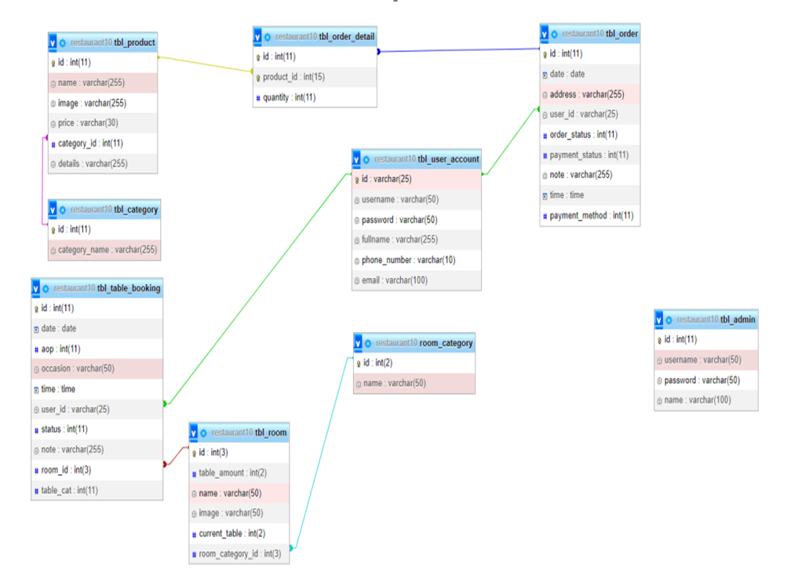
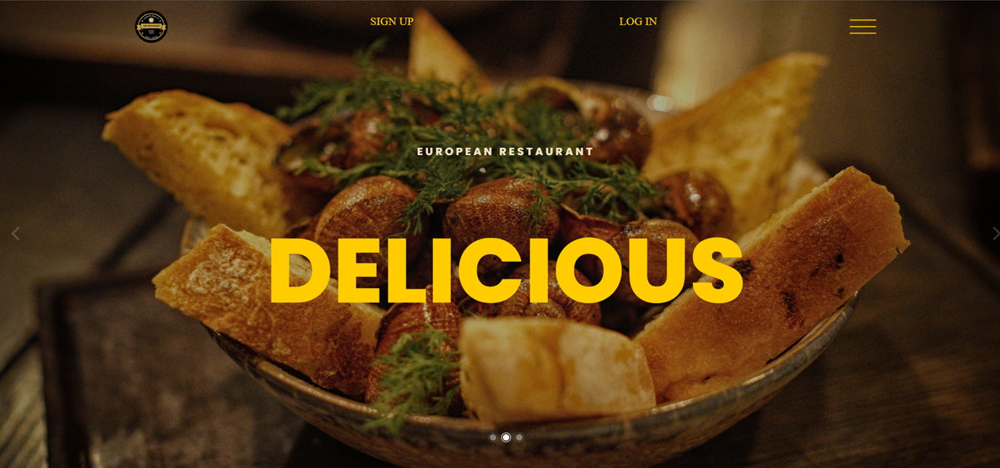
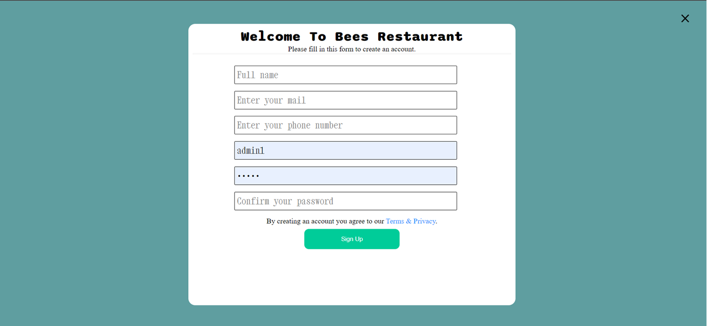
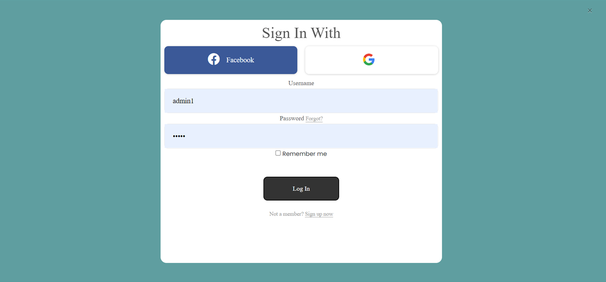
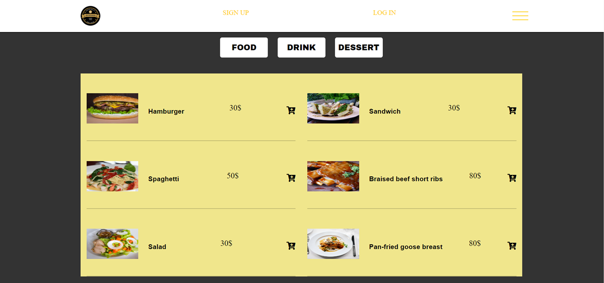
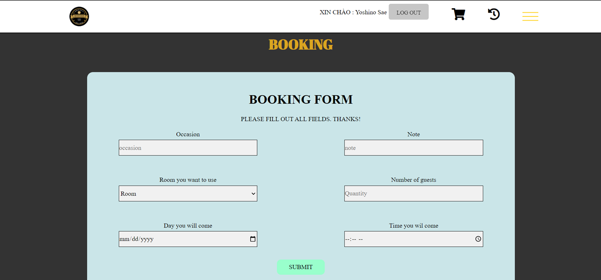
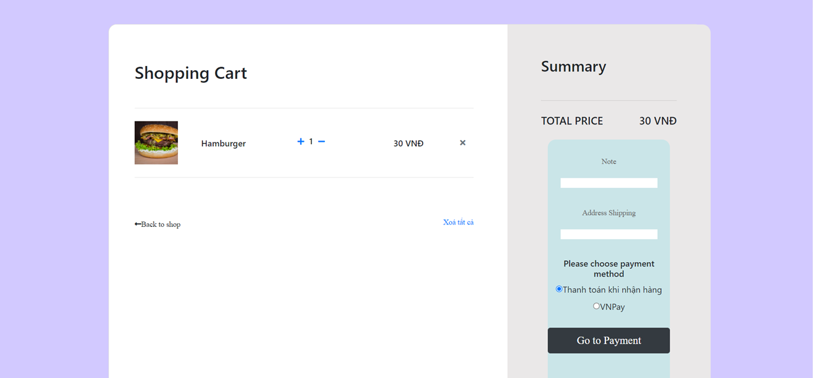
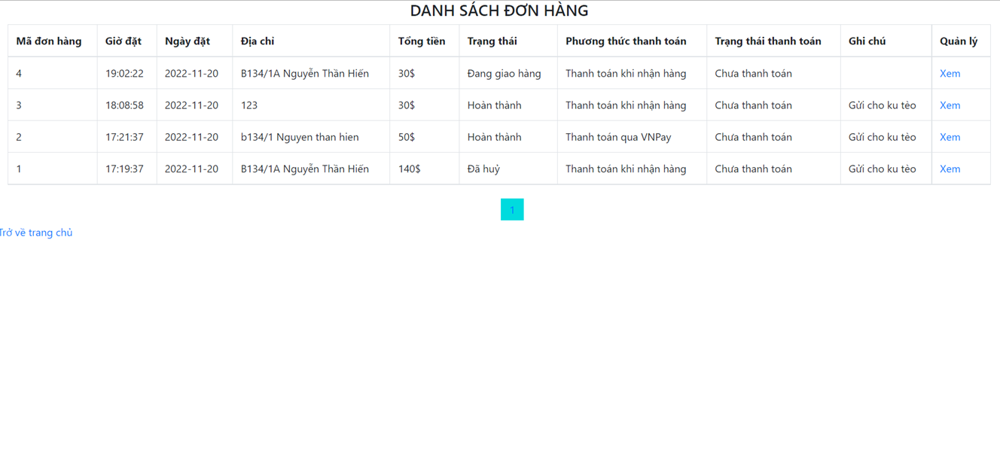
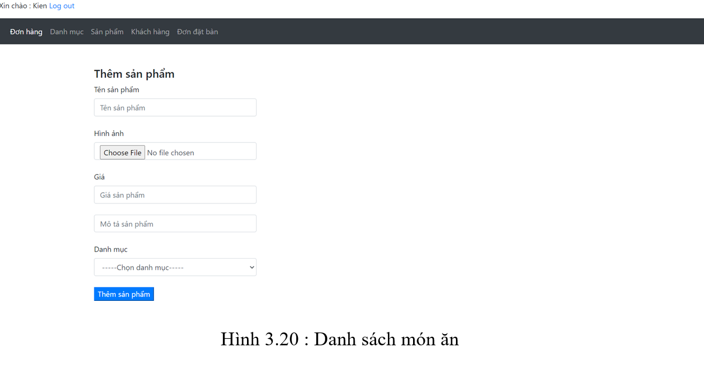

# [PHP + mySQL with XAMPP] Bee Restaurant

## Introduction

## How to use my project

Step 1 : Clone my project

`git clone https://github.com/thangnh1/restaurant.git`

Step 2 : Run XAMPP and import `restaurant.sql` to mySQL

Step 3 : Config connection in `restaurant/db/connect.php`

Step 4 : Open `http://localhost/restaurant/page/`

## Demo

   
  <i>Class Diagram</i>

   
  <i>Home</i>

   
  <i>Register</i>

   
  <i>Login</i>

   
  <i>Menu Order</i>

   
  <i>Booking Table</i>

   
  <i>Cart</i>

   
  <i>Order History</i>

   
  <i>Admin Area</i>

